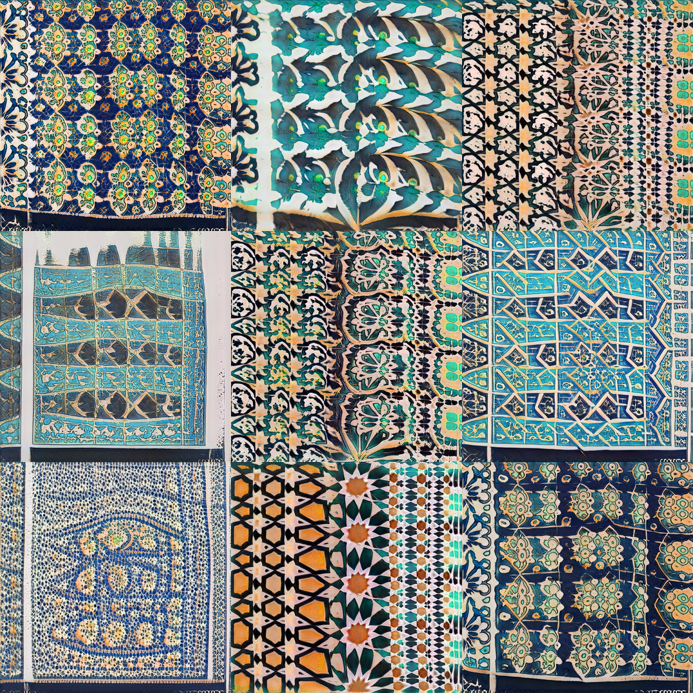
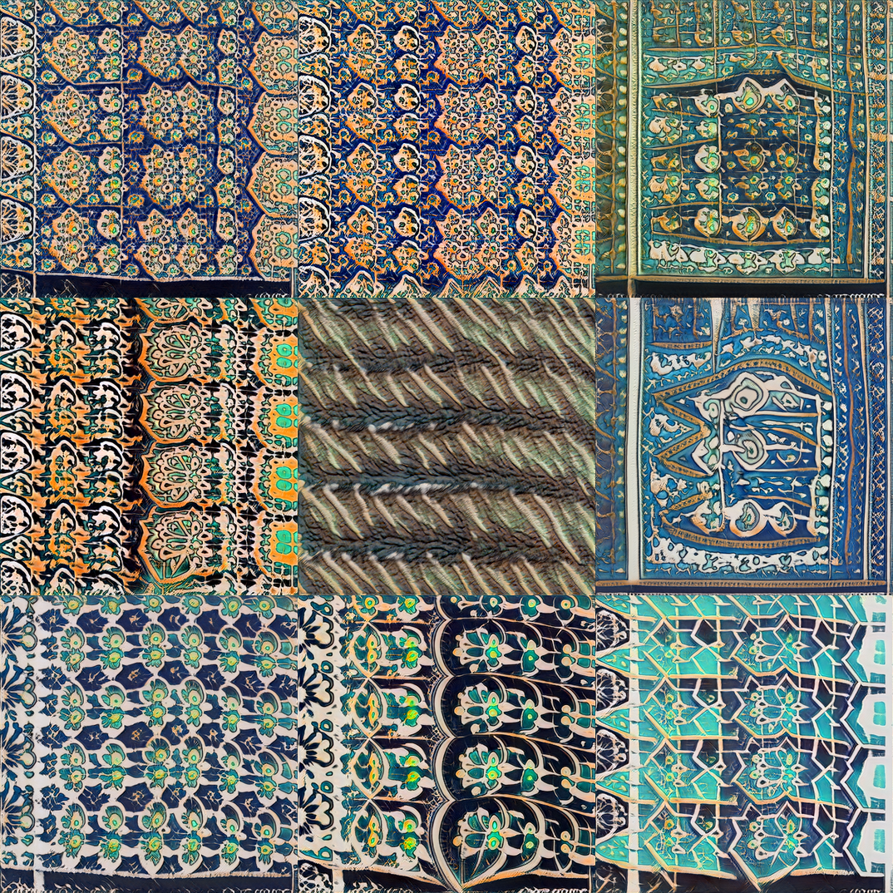
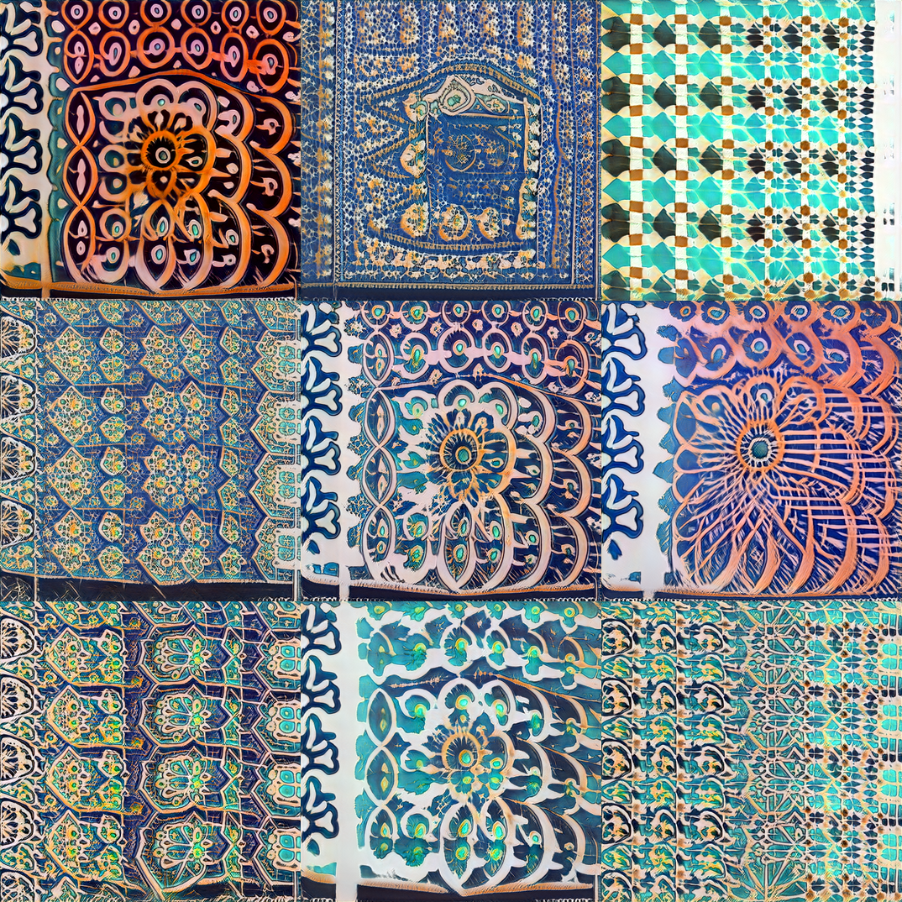
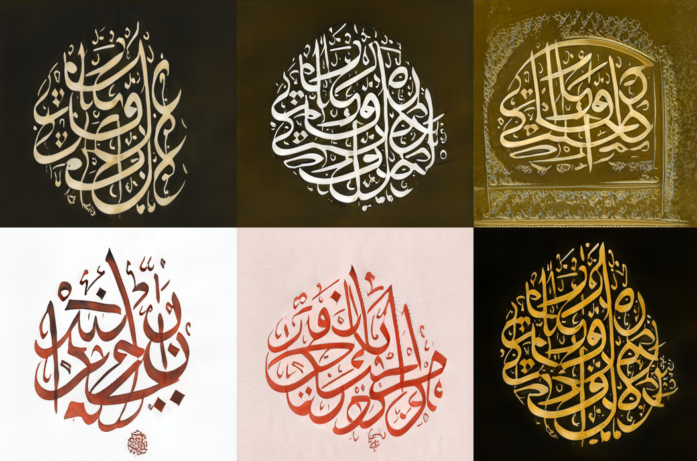
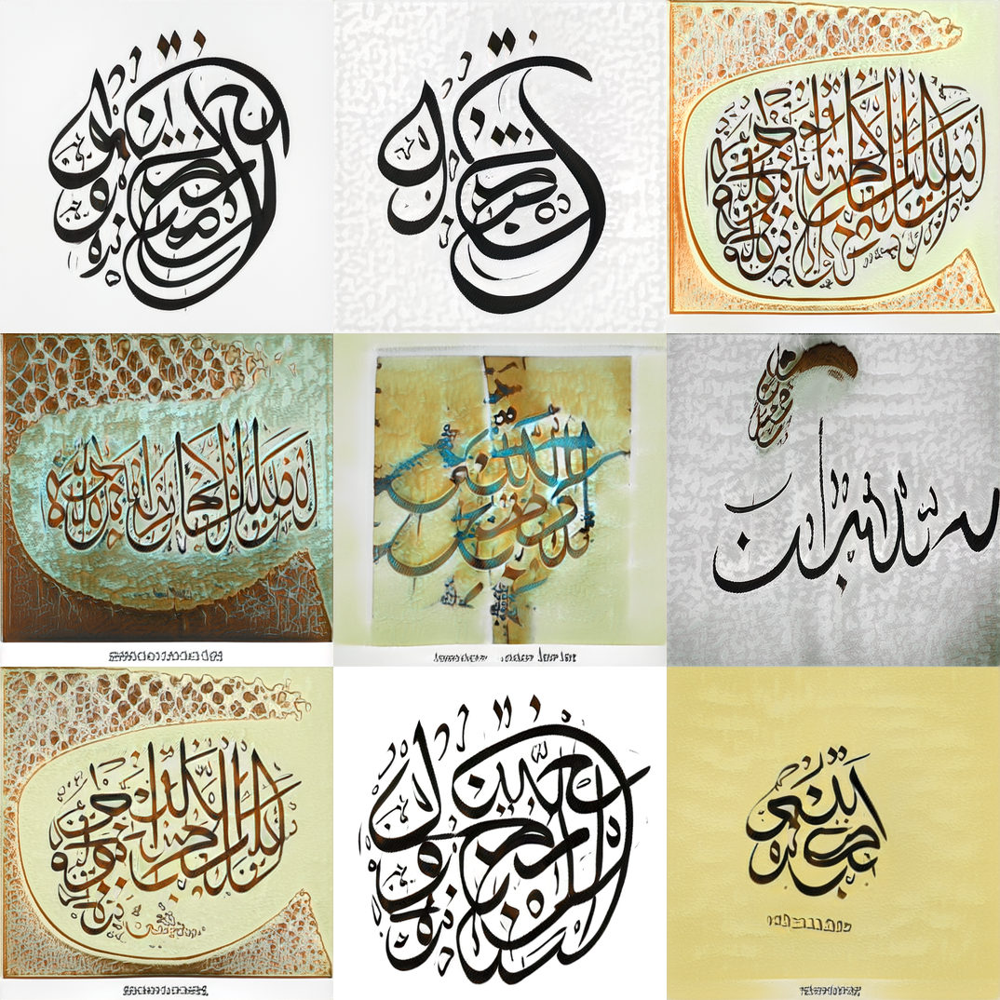
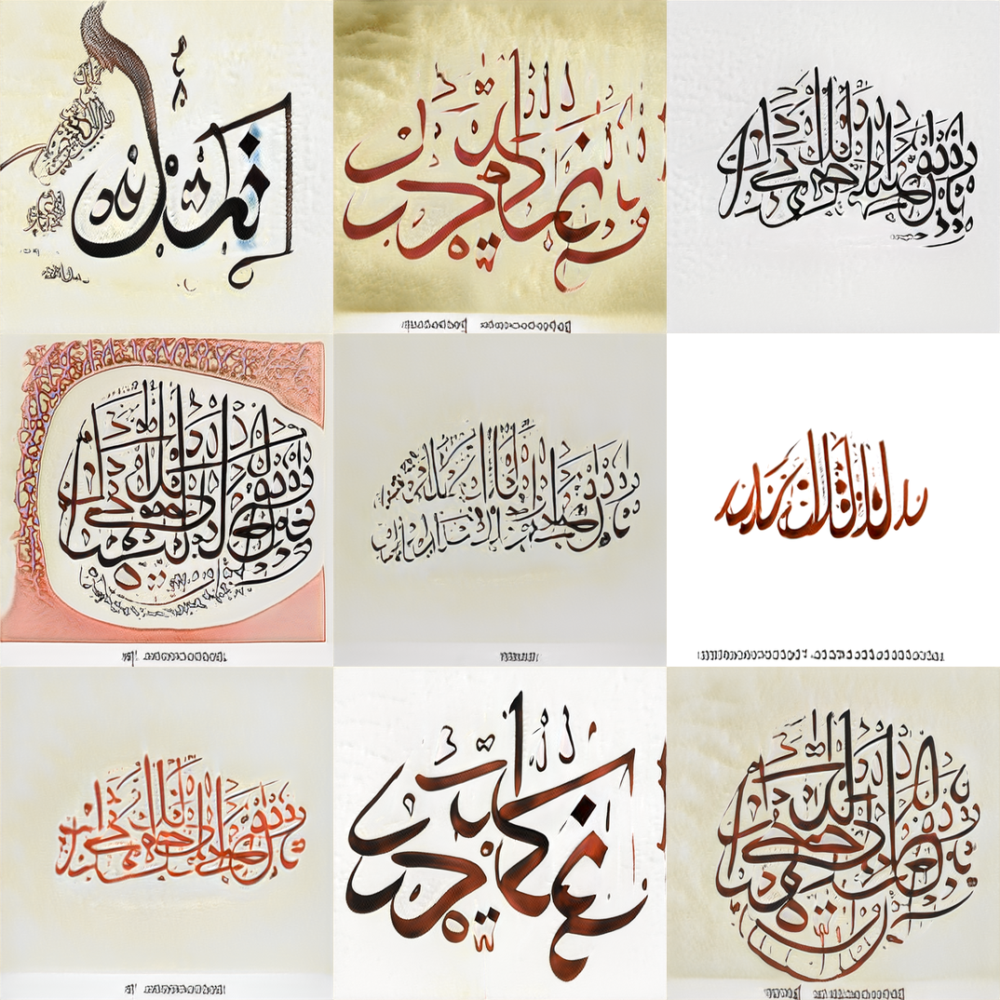
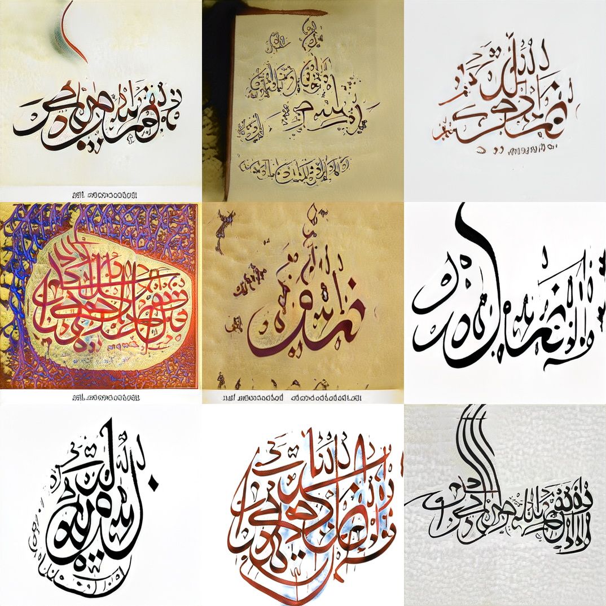

## rasm
Arabic art using GANs. We currently have two models for generating calligraphy and mosaics.  

## Notebooks 

<table class="tg">
  <tr>
    <th class="tg-yw4l"><b>Name</b></th>
    <th class="tg-yw4l"><b>Notebook</b></th>
  </tr>
  <tr>
    <td class="tg-yw4l">Visualization</td>
    <td class="tg-yw4l"><a href="https://colab.research.google.com/github/ARBML/rasm/blob/master/demo.ipynb">
  
</a></td>
  </tr>
</table>

## Visualization 
A set of functions for vis, interpolation and animation. Mostly tested in colab notebooks. 

### Load Model 
```python 
from rasm import Rasm
model = Rasm(mode = 'calligraphy')
model = Rasm(mode = 'mosaics')
```

### Generate random 
```python 
model.generate_randomly()
```

### Generate grid 
```python 
model.generate_grid()
```

### Generate animation 
```python
model.generate_animation(size = 2, steps = 20)
```


## Sample Models 

### Mosaics 




### Calligraphy 






## References 
- Gan-surgery: https://github.com/aydao/stylegan2-surgery
- WikiArt model: https://github.com/pbaylies/stylegan2 
- Starter-Notebook: https://github.com/Hephyrius/Stylegan2-Ada-Google-Colab-Starter-Notebook/